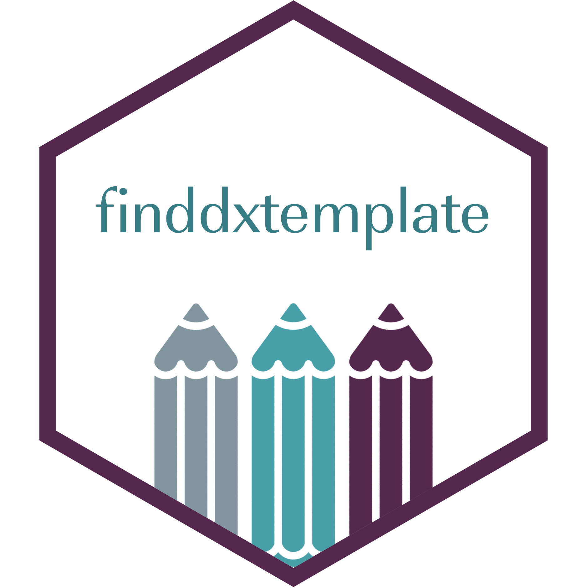

<!-- README.md is generated from README.Rmd. Please edit that file -->

# finddxtemplate 

[](https://forge.thinkr.fr/finddx/finddxtemplate/-/pipelines)
[](https://connect.thinkr.fr/finddxtemplate-pkgdown-website/coverage.html)

The {finddxtemplate} package provides design tools to create a Rmd
template for html documents.

Current version is 0.0.0.9000.

The documentation is available here:

  - pkgdown: <https://connect.thinkr.fr/finddxtemplate-pkgdown-website/>
  - coverage report:
    <https://connect.thinkr.fr/finddxtemplate-pkgdown-website/coverage.html>

## Installation

You can install the package with:

``` r
# install.packages("remotes")
remotes::install_local(path = "finddxtemplate_0.0.0.9000.tar.gz")
```

``` r
options(remotes.git_credentials = git2r::cred_user_pass("gitlab-ci-token", Sys.getenv("FORGE_THINKR_TOKEN")))
remotes::install_git("https://forge.thinkr.fr/thinkr/missions/finddx/finddxtemplate")
```

## Use the package
